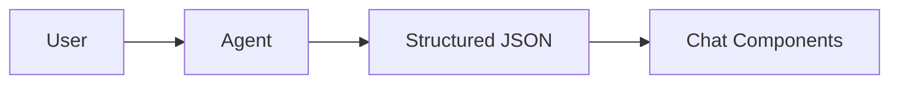

<div align="center">

</div>

# Run and deploy your AI Studio app

This contains everything you need to run your app locally.

View your app in AI Studio: https://ai.studio/apps/drive/1F38BfQ4YwwqqN7vUa8Uk6tckMkbvH-oc

## Run Locally

**Prerequisites:** Node.js, Python, `uv`


1. Install dependencies:
   `npm install`
2. Install Python backend dependencies:
   `uv venv .venv`
   `uv pip install -r requirements.txt`
3. Start the backend:
   `uv run python -m services.agent_server`
4. Run the app:
   `npm run dev`

## Current Local Backend

- Frontend calls `VITE_API_URL=http://localhost:8000/chat`
- Backend proxies to `http://localhost:9006/v1`
- Current OpenAI-compatible model: `qwen`

## Structured Chat Renderer

The current chat UI supports structured AG-UI components including:

- `markdown`
- `info_card`
- `data_list`
- `step_process`
- `table`
- `stat_grid`
- `code_block`
- `action_group`

Markdown also supports Mermaid fenced blocks, for example:

````md

````
